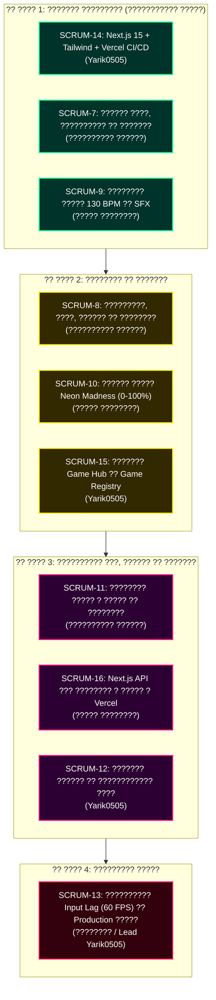

# ?? Duck Verse ? Next.js Cyberpunk Game Hub & Geometry Dash

<div align="center">

```
  ??????? ???   ??? ??????????  ???    ???   ?????????????????? ????????????????
  ???????????   ?????????????? ????    ???   ???????????????????????????????????
  ???  ??????   ??????     ???????     ???   ?????????  ??????????????????????  
  ???  ??????   ??????     ???????     ???? ??????????  ??????????????????????  
  ???????????????????????????? ????     ??????? ???????????  ???????????????????
  ???????  ???????  ??????????  ???      ?????  ???????????  ???????????????????
```

### ?? ???????? ????????? Game Hub ?? Next.js 15, Tailwind CSS ?? Vercel
**??????????? ??? ???????: ??????? ?????????? ????-??????????? Geometry Dash Neon**

---

[](https://vercel.com/new/clone?repository-url=https%3A%2F%2Fgithub.com%2Fgreenyarik0505-jpg%2Fduck-verse)
[-000000?style=for-the-badge&logo=next.js&logoColor=white)](https://nextjs.org/)
[](https://react.dev/)
[](https://tailwindcss.com/)
[](https://vercel.com/)
[](https://gta6-sliv-cyberleek.atlassian.net)
[](LICENSE)
[](CONTRIBUTING.md)

</div>

---

## ?? ????? (Table of Contents)

1. [??? ?????? Duck Verse](#-???-??????-duck-verse)
2. [??????? ??????????? ?????????](#-???????-???????????-?????????)
3. [??????????? ???: Geometry Dash Neon](#-???????????-???-geometry-dash-neon)
   - [?????? ?? ???????? ???? ????](#??????-??-????????-????-????)
   - [??????? ???????? ?? ???????????? ??'????](#???????-????????-??-????????????-??????)
   - [??????????? ?????-?????????? (130 BPM)](#???????????-?????-??????????-130-bpm)
   - [HUD, ???????-??? ?? ????????? ?????](#hud-???????-???-??-?????????-?????)
4. [???????? ??????????? Game Registry](#-????????-???????????-game-registry)
5. [??????? ???????? ?? ???? ????????????????](#-???????-????????-??-????-????????????????)
6. [??????? ????? ???????? ?? ??????? (Roadmap)](#-???????-?????-????????-??-???????-roadmap)
7. [????????? ?????????? ???????](#-?????????-??????????-???????)
8. [?????????? ????????? ?????? (Getting Started)](#-??????????-?????????-??????-getting-started)
9. [?????? ?? Vercel (Vercel Deployment)](#-??????-??-vercel-vercel-deployment)
10. [??????? ????????? ???????? ?? Git Flow](#-???????-?????????-????????-??-git-flow)
11. [?????????? ? Atlassian Jira Cloud](#-??????????-?-atlassian-jira-cloud)
12. [????????](#-????????)

---

## ?? ??? ?????? Duck Verse

**Duck Verse** ? ?? ????????, ?????????????????? ???-?????? ???? (**Game Hub**), ??????????? ?? ???? ????? **Next.js 15 (App Router)**, **Tailwind CSS** ?? ???????? ?? **Vercel**. 

??????? ????????? ??????? ? **??????? ????? ??? ??????????**: ????????? ???????????? ???, ?? ????-???? ????????? ???? ?????????? ???? HTML5/Canvas ??? ?? ?????? ??????? ????? ?????? ?????? `Game Registry`, ??????????? ????????? ??? ????? ???:
* ????? ??????? ???? ? ??????? ?? ??????????? ?? ???????????;
* ????????? ???????? ????? ??????? ? ?????????? ?????????????? ??????;
* ??????? ?????? ?????? (**QuackCoins**);
* ???????? ??????? ??????? ?? ?????????? ???????? ????? Vercel Serverless API;
* ?????? ????????? ????? ?? ???????? ??????? ?? Web Audio API.

?????? ???????????? ????, ??? ??? ????????? ???? ?????????, ? **Geometry Dash Neon** ? ???????? ????-?????????? ?? ?????? 60 FPS ??????? ??????, ?????????????? ????????, ??????????? ??????? ?? ??????????? 130 BPM ?????-??????.

---

## ? ??????? ??????????? ?????????

* **? ????????? Next.js 15 & React 19**: ???????? ?????? ??????????, Server-Side Rendering ?? ???????? ???????????.
* **?? ???????????? CI/CD ?????? ?? Vercel**: ????? Pull Request ??????????? ?????????? ? Preview-?????? ??? ?????????? ??? ?? ?????????? ?? ?????????.
* **?? 60 FPS Canvas 2D Engine**: ??????? ??????? ???? ??? ???????? ????? (zero input lag), ???????? ???????? ??? ?????????? ????-????.
* **?? Zero-Asset Web Audio ??????????**: ???????? ???????? ? ??????? ?????? (???????, ??????, ??????) ??????????? ?????????? ????? ? ???????? ????? Web Audio API ??? ???????????? ????????????? ????? MP3-?????.
* **?? ????? ????????? (QuackCoins)**: ??????, ????????? ? ????? ???, ???????????? ? ??????? ?????? ?? ?????? ??????????? ? ???????? ???????????? ??????.
* **?? ????? ????????????**: ????????? ????????? ?? ??????????? (Space, ???????), ??? ? ?????????? ???????? ??????????/?????????.

---

## ??? ??????????? ???: Geometry Dash Neon

??? **Geometry Dash Neon** ? ????? ??????? ?????? ????. ???? ???????? ???????? ???????? ???????????? ??? ? ??????????? ????????? ?????.

### ?????? ?? ???????? ???? ????
* **?????? ????**: `36 ? 36` ???????? ?? ?????? ??????, ???????? ??????? ?? ???????????? ????????.
* **????????????? ?????????**: ????????? ????????? ???? `speed = 5.2 px/frame`.
* **??????????**: ??????????? ??????? `gravity = 0.95 px/frame?`.
* **??????? ???????**: ??????? ??????????? ????????? `jumpForce = -13.5 px/frame`.
* **?????????**: ??? ??? ??????????? ? ??????? ????? ?????? ??????????? ??????? ???????? ?????? (`+0.14 rad/frame`). ??? ??????????? ?? ??????? ??? ????????? ??? ??????????? ???????????? ?? ?????????? ?? ??????????? ???? 90 ???????? (`snap to grid`).

### ??????? ???????? ?? ???????????? ??'????
| ??'??? | ?????????? ?????? | ????????? ? ??? |
| :--- | :--- | :--- |
| **???????? ??? (`spike`)** | ???????? ????????? ?? ?????????? ????????? | ??? ????????????? ??????? ?? ????????? ??????? ????????. ???????? ???????? ????? ???? ?? ??????????. |
| **??????? ???? (`block`)** | ???????? ??????? ?? ?????????? ???????? ???????? | ???????? ???????? ???????????? ?????? ? ???????????? ???. ????????? ? ?????/??????? ?????? ?????? ???. |
| **?????? ????? (`pad`)** | ?????? ??????? ????? ?? ??????? ?? ????????? | ??????????? ??????????? ??? ?????????? ?? ???????? ??? ?? ???????? ?????? (`jumpForce * 1.35`). |
| **????? ????? (`orb`)** | ????????? ????? ?????? ? ??????? | ???????? ??????? ????????? ??????? ? ???????, ???? ??????? ???????? ??????? ????????? ??????? ??? ?????. |
| **???????? ?????? (`coin`)** | ?????? ??????? ?????? | 3 ????????? ?????? ?? ????? ? ?????????????? ??????, ????? ??? +10 QuackCoins. |

### ??????????? ?????-?????????? (130 BPM)
? ?????? ????????? ????????? ?????? ??????????? Web Audio API ??????:
* ?????????? ????????? ????????? ?????? ?????? ? ??????????? A-minor ?? ????? **132 BPM** ? ????????????? ????????????? (`sawtooth`) ??????????? ?? ??????????????? ?????????? (`lowpass filter`).
* ?? ????? ?????? ??? ???????????? ??????? ?????? (Hi-hat/Snare) ????? ????? ?????? ????.
* ??? ????????? ????? ??????????? ? ??????????? ?????? ?????? ??? ????????? ??????? ?????? ????-????.

### HUD, ???????-??? ?? ????????? ?????
* **???????-???**: ??????? ????? ????? ??????, ?? ???????????? ?????????? ??? 0% ?? 100% ? ????????? ????:
  $$	ext{Percent} = \min\left(100, \left\lfloor rac{	ext{CameraX}}{	ext{LevelLength}} 	imes 100 
ight
floor
ight)$$
* **????????? ????? (Attempt Counter)**: ???????????? ????? ?????? ??????????? ?? ???????? ????????? ?????? ?????? (`Best %`) ? `localStorage` ?? ?? ??????? Vercel.

---

## ?? ???????? ??????????? Game Registry

????????? ????????? ????????? ??????????? ???? ????? ?????? [`lib/games/registry.js`](lib/games/registry.js). 

### ?? ?????????? ???? ??? ? Duck Verse ?? 3 ?????:

#### ???? 1. ???????? ???? ????? ???
?????????? ???? ??? ? ???????? `start()` ?? `stop()` ? ????? `lib/games/`:

```javascript
// lib/games/my_awesome_game.js
export class MyAwesomeGame {
  constructor(canvas, onGameOver, onAddCoins) {
    this.canvas = canvas;
    this.onGameOver = onGameOver;
    this.onAddCoins = onAddCoins;
  }
  start() { /* ?????? ????? ??? */ }
  stop() { /* ??????? ???????? ? ???????? */ }
}
```

#### ???? 2. ???????????? ??? ? ??????
????????? [`lib/games/registry.js`](lib/games/registry.js) ? ??????? ???? ???:

```javascript
{
  id: 'space_shooter',
  title: 'Space Shooter Neon',
  tag: 'SHOOTER',
  badge: 'NEW',
  desc: '????????? ????? ?? ???????????? ??????? ?????????????.',
  rating: '5.0 ?',
  category: 'action',
  icon: '??'
}
```

#### ???? 3. ??? ??????????? ????????!
??? ??????? ?'??????? ? ??????? ????, ? ??????, ? ??????? ?????????? ????????? ?? ??????? ?????? ?? ?????????? ??????? QuackCoins!

---

## ?? ??????? ???????? ?? ???? ????????????????

?????? ????????????? ??????????? ???????? ? 3 ???????????? ?? ?????? ?????????? ????????? ? [Jira Board](https://gta6-sliv-cyberleek.atlassian.net):

| ??????? | ???? ? ??????? | GitHub ??????? | ???? ???????????????? | ?????? ? Jira |
| :--- | :--- | :--- | :--- | :--- |
| **Yarik0505** | **Lead Frontend & Vercel DevOps** | [@greenyarik0505-jpg](https://github.com/greenyarik0505-jpg) | Next.js 15, ??????????? ????, Vercel CI/CD, ??????? ??????, ????? | `SCRUM-14`, `SCRUM-15`, `SCRUM-12`, `SCRUM-13` |
| **?????????? ??????** | **Gameplay & Physics Engineer** | [@DiminiReal](https://github.com/DiminiReal) | Canvas 2D ?????, ?????? ????, ????????, ???????? ???????? | `SCRUM-7`, `SCRUM-8`, `SCRUM-11` |
| **????? ????????** | **Audio, Level Design & Backend State** | [@kirilpuskaruk-svg](https://github.com/kirilpuskaruk-svg) | Web Audio API 130 BPM, ?????? ?????? 0-100%, Next.js API | `SCRUM-9`, `SCRUM-10`, `SCRUM-16` |

---

## ??? ??????? ????? ???????? ?? ??????? (Roadmap)

??? ?????? ????????????? ?? **4 ?????????? ????**, ??? ???????? ?????????? ? ????:



---

## ??? ????????? ?????????? ???????

```
duck-verse/
??? .github/
?   ??? ISSUE_TEMPLATE/
?   ?   ??? task.yml                  # ?????? ??? ????????? ????? ? ????'????? ?? Jira
?   ??? workflows/
?   ?   ??? ci.yml                    # ??????????? ????????? ?????????? ?? ??????
?   ??? pull_request_template.md      # ????'??????? ?????? PR ? ?????? ?????????
??? app/
?   ??? api/
?   ?   ??? scores/
?   ?       ??? route.js              # Serverless API ???? ??? ???????? ? ??????????
?   ??? layout.js                     # ???????? layout, ???????? ?? ?????? Orbitron
?   ??? page.js                       # ???????????? ??????? Game Hub (Next.js ??????)
??? components/                       # ??????????? ?????????? ??????????
??? lib/
?   ??? games/
?       ??? geometry_dash.js          # ???? ????? Geometry Dash Neon
?       ??? registry.js               # ????????? ?????? ???? ????
??? src/
?   ??? audio.js                      # ??????????? Web Audio ?????????? (130 BPM)
?   ??? hub.js                        # ?????????? ?????? ???? ??? standalone ??????
?   ??? games/                        # ?????? ?????????? ?????????? ????
??? next.config.mjs                   # ???????????? Next.js
??? package.json                      # ?????????? ??????? (Next.js 15, React 19)
??? vercel.json                       # ???????????? ?????????? ?? ???????? Vercel
??? CONTRIBUTING.md                   # ???????? ??????? ????????, ????? ?? ???????
??? LICENSE                           # ???????? ???????? MIT
??? README.md                         # ???????????? ???????
```

---

## ?? ?????????? ????????? ?????? (Getting Started)

### ???????? ??????:
* **Node.js**: ?????? `18.18.0` ??? ?????? (`node --version`)
* **npm**: ?????? `9.0.0` ??? ?????? (`npm --version`)
* **Git**: ???????????? ?????? Git

### ?????????? ????????????:

```bash
# 1. ????????? ??????????? ?? ????????? ????'????
git clone https://github.com/greenyarik0505-jpg/duck-verse.git

# 2. ??????? ?? ????? ???????
cd duck-verse

# 3. ?????????? ?????????? ???????
npm install

# 4. ????????? ????????? ?????? ????????
npm run dev
```

????? ????????? ??????? ????????? ??????? ?? ???????:  
?? **http://localhost:3000**

---

## ?? ?????? ?? Vercel (Vercel Deployment)

?????? ?? 100% ????????????? ??? ????????????? ?????? ?? Vercel:

### ??????? ?: ????? ???-????????? (?????????????)
1. ????????? ?????? **Deploy with Vercel** ?? ??????? ????? README.
2. ?????????? ???? ????????? ????? GitHub ?? ???????? ??????????? `greenyarik0505-jpg/duck-verse`.
3. Vercel ??????????? ????????? ???????????? `nextjs` ? `vercel.json` ?? ?????? ?????? ?? 30 ??????.

### ??????? ?: ????? Vercel CLI
```bash
# ?????????? Vercel CLI ?????????
npm install -g vercel

# ????????? ??????
vercel
```

---

## ?? ??????? ????????? ???????? ?? Git Flow

??? ?????????? ??????? ????? `main` ??????? ???????????? ????? ??????:

### 1. ????????? ?????
????? ????? ??????????? ??? ?????????? `main` ?? ??????? ???? ?????? ? Jira:
* `feature/SCRUM-14-nextjs-setup`
* `feature/SCRUM-7-cube-physics`
* `feature/SCRUM-9-audio-synth`

### 2. ?????? ??????????? ??????? (Conventional Commits)
* `feat(SCRUM-XX): ?????? ???? ????????????????`
* `fix(SCRUM-XX): ?????????? ??????? ?? ???`
* `docs(SCRUM-XX): ???????? ????????????`
* `refactor(SCRUM-XX): ??????????? ???? ??? ????? ??????`

### 3. ????????? Pull Request
1. ????? ?????????? PR ?????????????, ?? `npm run build` ????????? ??? ???????.
2. ???????? PR ?? ???????????? ????????: ??????? ?????? ? Jira ?? ????? ???'????.
3. ????? ????????? (Approve) ??????? **Squash and Merge** ? ????? `main`.

---

## ?? ?????????? ? Atlassian Jira Cloud

??? ???????? ?????????????? ?? ?????? ?????:
* **Jira URL**: [gta6-sliv-cyberleek.atlassian.net](https://gta6-sliv-cyberleek.atlassian.net)
* **??????**: `SCRUM`
* **???????? ??????**: `???????? ????`
* **???????? ????**: `SCRUM-6` (*Geometry Dash ? ??????? ????? ?? ????? ??? ? Duck Verse*)

---

## ?? ????????

?????? ???????? ??? ????????? ????????? **[MIT](LICENSE)**. ????????? ?????? ????????????, ??????????? ?? ?????????? ?????????.

<div align="center">
  <b>???????? ? ?????'? ???????? Duck Verse ???</b><br/>
  <i>Yarik0505 ? ?????????? ?????? ? ????? ????????</i>
</div>
