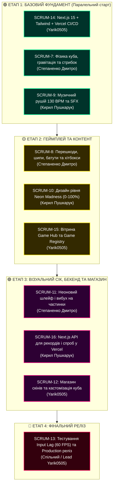

# 🌌 Duck Verse — Next.js Cyberpunk Game Hub & Geometry Dash

<div align="center">

```
  ██████╗ ██╗   ██╗ ██████╗██╗  ██╗    ██╗   ██╗███████╗██████╗ ███████╗███████╗
  ██╔══██╗██║   ██║██╔════╝██║ ██╔╝    ██║   ██║██╔════╝██╔══██╗██╔════╝██╔════╝
  ██║  ██║██║   ██║██║     █████═╝     ██║   ██║█████╗  ██████╔╝███████╗█████╗  
  ██║  ██║██║   ██║██║     ██╔═██╗     ╚██╗ ██╔╝██╔══╝  ██╔══██╗╚════██║██╔══╝  
  ██████╔╝╚██████╔╝╚██████╗██║ ╚██╗     ╚████╔╝ ███████╗██║  ██║███████║███████╗
  ╚═════╝  ╚═════╝  ╚═════╝╚═╝  ╚═╝      ╚═══╝  ╚══════╝╚═╝  ╚═╝╚══════╝╚══════╝
```

### 🚀 Сучасний модульний Game Hub на Next.js 15, Tailwind CSS та Vercel
**Флагманська гра спринту: репліка культового ритм-платформера Geometry Dash Neon**

---

[](https://vercel.com/new/clone?repository-url=https%3A%2F%2Fgithub.com%2Fgreenyarik0505-jpg%2Fduck-verse)
[-000000?style=for-the-badge&logo=next.js&logoColor=white)](https://nextjs.org/)
[](https://react.dev/)
[](https://tailwindcss.com/)
[](https://vercel.com/)
[](https://gta6-sliv-cyberleek.atlassian.net)
[](LICENSE)
[](CONTRIBUTING.md)

</div>

---

## 📑 Зміст (Table of Contents)

1. [Про проект Duck Verse](#-про-проект-duck-verse)
2. [Головні особливості платформи](#-головні-особливості-платформи)
3. [Флагманська гра: Geometry Dash Neon](#-флагманська-гра-geometry-dash-neon)
   - [Фізика та механіка руху куба](#фізика-та-механіка-руху-куба)
   - [Система перешкод та інтерактивні об'єкти](#система-перешкод-та-інтерактивні-обєкти)
   - [Процедурний аудіо-синтезатор (130 BPM)](#процедурний-аудіо-синтезатор-130-bpm)
   - [HUD, Прогрес-бар та лічильник спроб](#hud-прогрес-бар-та-лічильник-спроб)
4. [Модульна архітектура Game Registry](#-модульна-архітектура-game-registry)
5. [Команда розробки та зони відповідальності](#-команда-розробки-та-зони-відповідальності)
6. [Дорожня карта розробки за етапами (Roadmap)](#-дорожня-карта-розробки-за-етапами-roadmap)
7. [Структура директорій проекту](#-структура-директорій-проекту)
8. [Покроковий локальний запуск (Getting Started)](#-покроковий-локальний-запуск-getting-started)
9. [Деплой на Vercel (Vercel Deployment)](#-деплой-на-vercel-vercel-deployment)
10. [Правила командної розробки та Git Flow](#-правила-командної-розробки-та-git-flow)
11. [Інтеграція з Atlassian Jira Cloud](#-інтеграція-з-atlassian-jira-cloud)
12. [Ліцензія](#-ліцензія)

---

## 🌌 Про проект Duck Verse

**Duck Verse** — це сучасний, високопродуктивний веб-портал ігор (**Game Hub**), розроблений на базі стеку **Next.js 15 (App Router)**, **Tailwind CSS** та хостингу на **Vercel**. 

Головна філософія проекту — **нульове тертя для розширення**: платформа спроектована так, що будь-який розробник може підключити нову HTML5/Canvas гру за лічені хвилини через єдиний реєстр `Game Registry`, автоматично отримуючи для своєї гри:
* Єдину вітрину хабу з пошуком та фільтрацією за категоріями;
* Адаптивне модальне вікно запуску з підтримкою повноекранного режиму;
* Спільну ігрову валюту (**QuackCoins**);
* Серверну таблицю лідерів та збереження рекордів через Vercel Serverless API;
* Єдиний контролер звуку та звукових ефектів на Web Audio API.

Першою флагманською грою, під яку будується ядро платформи, є **Geometry Dash Neon** — неоновий ритм-платформер із чесною 60 FPS фізикою кубика, інтерактивними батутами, стрибковими сферами та процедурним 130 BPM аудіо-рушієм.

---

## ⚡ Головні особливості платформи

* **⚡ Швидкість Next.js 15 & React 19**: миттєвий відгук інтерфейсу, Server-Side Rendering та статична оптимізація.
* **☁️ Автоматичний CI/CD деплой на Vercel**: кожен Pull Request автоматично збирається у Preview-версію для тестування гри на смартфонах та ноутбуках.
* **🎮 60 FPS Canvas 2D Engine**: плавний ігровий цикл без затримок вводу (zero input lag), критично важливий для хардкорних ритм-ігор.
* **🎵 Zero-Asset Web Audio Синтезатор**: музичний супровід і звукові ефекти (стрибки, вибухи, монети) генеруються процедурно прямо в браузері через Web Audio API без необхідності завантажувати важкі MP3-файли.
* **🪙 Єдина економіка (QuackCoins)**: монети, зароблені в одній грі, зберігаються у гаманці гравця та можуть витрачатися в магазині кастомізації скінів.
* **📱 Повна адаптивність**: підтримка керування як клавіатурою (Space, Стрілки), так і сенсорними екранами смартфонів/планшетів.

---

## 🕹️ Флагманська гра: Geometry Dash Neon

Гра **Geometry Dash Neon** є ядром першого релізу хабу. Вона реалізує класичні механіки оригінальної гри в авторському кіберпанк стилі.

### Фізика та механіка руху куба
* **Розмір куба**: `36 × 36` пікселів із чорною каймою, неоновим візором та декоративним обличчям.
* **Горизонтальна швидкість**: фіксована швидкість бігу `speed = 5.2 px/frame`.
* **Гравітація**: прискорення падіння `gravity = 0.95 px/frame²`.
* **Імпульс стрибка**: миттєва вертикальна швидкість `jumpForce = -13.5 px/frame`.
* **Обертання**: під час перебування у повітрі кубик плавно обертається навколо власного центру (`+0.14 rad/frame`). При приземленні на підлогу або платформу кут автоматично округлюється та фіксується до найближчого кута 90 градусів (`snap to grid`).

### Система перешкод та інтерактивні об'єкти
| Об'єкт | Візуальний вигляд | Поведінка у грі |
| :--- | :--- | :--- |
| **Неоновий шип (`spike`)** | Червоний трикутник із внутрішнім світінням | Має оптимізований хітбокс із невеликим буфером прощення. Торкання викликає вибух куба та перезапуск. |
| **Твердий блок (`block`)** | Ціановий квадрат із внутрішнім неоновим акцентом | Дозволяє безпечно приземлитися зверху і продовжувати біг. Зіткнення з лівою/нижньою гранню вбиває куб. |
| **Жовтий батут (`pad`)** | Жовтий плоский еліпс на підлозі чи платформі | Автоматично активується при наступанні та запускає куб на подвійну висоту (`jumpForce * 1.35`). |
| **Жовта сфера (`orb`)** | Пульсуюче жовте кільце в повітрі | Дозволяє зробити повторний стрибок у повітрі, якщо гравець натискає стрибок усередині радіуса дії сфери. |
| **Секретна монета (`coin`)** | Золота зіркова монета | 3 приховані монети на рівні у важкодоступних місцях, кожна дає +10 QuackCoins. |

### Процедурний аудіо-синтезатор (130 BPM)
В основі звукового супроводу лежить процедурний Web Audio API двигун:
* Синтезатор відтворює динамічну басову партію у тональності A-minor на темпі **132 BPM** з використанням пилкоподібних (`sawtooth`) осциляторів та низькочастотної фільтрації (`lowpass filter`).
* На кожен парний біт синтезується шумовий сплеск (Hi-hat/Snare) через буфер білого шуму.
* Усі перешкоди рівня розставлені з урахуванням тактів музики для створення повного ефекту ритм-ігри.

### HUD, Прогрес-бар та лічильник спроб
* **Прогрес-бар**: неонова смуга вгорі екрана, що заповнюється градієнтом від 0% до 100% у реальному часі.
* **Лічильник спроб (Attempt Counter)**: відслідковує кожну спробу проходження та зберігає особистий рекорд гравця (`Best %`) у `localStorage` та на сервері Vercel.

---

## 🔌 Модульна архітектура Game Registry

Платформа підтримує динамічне підключення ігор через реєстр [`lib/games/registry.js`](lib/games/registry.js). 

### Як підключити нову гру в Duck Verse за 3 кроки:

#### Крок 1. Створіть файл рушія гри
Реалізуйте клас гри з методами `start()` та `stop()` у папці `lib/games/`:

```javascript
// lib/games/my_awesome_game.js
export class MyAwesomeGame {
  constructor(canvas, onGameOver, onAddCoins) {
    this.canvas = canvas;
    this.onGameOver = onGameOver;
    this.onAddCoins = onAddCoins;
  }
  start() { /* Запуск циклу гри */ }
  stop() { /* Зупинка таймерів і слухачів */ }
}
```

#### Крок 2. Зареєструйте гру у списку
Відкрийте [`lib/games/registry.js`](lib/games/registry.js) і додайте опис гри:

```javascript
{
  id: 'space_shooter',
  title: 'Space Shooter Neon',
  tag: 'SHOOTER',
  badge: 'NEW',
  desc: 'Космічний шутер із процедурними хвилями супротивників.',
  rating: '5.0 ★',
  category: 'action',
  icon: '🚀'
}
```

#### Крок 3. Гра автоматично доступна!
Гра миттєво з'явиться у вітрині хабу, у пошуку, в системі фільтрації категорій та отримає доступ до загального гаманця QuackCoins!

---

## 👥 Команда розробки та зони відповідальності

Проект розробляється згуртованою командою з 3 спеціалістів із чітким розподілом напрямків у [Jira Board](https://gta6-sliv-cyberleek.atlassian.net):

| Учасник | Роль у команді | GitHub профіль | Зона відповідальності | Задачі в Jira |
| :--- | :--- | :--- | :--- | :--- |
| **Yarik0505** | **Lead Frontend & Vercel DevOps** | [@greenyarik0505-jpg](https://github.com/greenyarik0505-jpg) | Next.js 15, Архітектура хабу, Vercel CI/CD, Магазин скінів, Реліз | `SCRUM-14`, `SCRUM-15`, `SCRUM-12`, `SCRUM-13` |
| **Степаненко Дмитро** | **Gameplay & Physics Engineer** | [@DiminiReal](https://github.com/DiminiReal) | Canvas 2D рушій, фізика куба, хітбокси, анімація частинок | `SCRUM-7`, `SCRUM-8`, `SCRUM-11` |
| **Кирил Пушкарук** | **Audio, Level Design & Backend State** | [@kirilpuskaruk-svg](https://github.com/kirilpuskaruk-svg) | Web Audio API 130 BPM, дизайн рівнів 0-100%, Next.js API | `SCRUM-9`, `SCRUM-10`, `SCRUM-16` |

---

## 🗺️ Дорожня карта розробки за етапами (Roadmap)

Всі задачі структуровані на **4 послідовні фази**, щоб уникнути конфліктів у коді:



---

## 🏗️ Структура директорій проекту

```
duck-verse/
├── .github/
│   ├── ISSUE_TEMPLATE/
│   │   └── task.yml                  # Шаблон для створення задач з прив'язкою до Jira
│   ├── workflows/
│   │   └── ci.yml                    # Автоматична перевірка компіляції та тестів
│   └── pull_request_template.md      # Обов'язковий шаблон PR з полями перевірки
├── app/
│   ├── api/
│   │   └── scores/
│   │       └── route.js              # Serverless API роут для рекордів і лідерборду
│   ├── layout.js                     # Головний layout, метадані та шрифти Orbitron
│   └── page.js                       # Інтерактивна вітрина Game Hub (Next.js клієнт)
├── components/                       # Реюзабельні компоненти інтерфейсу
├── lib/
│   └── games/
│       ├── geometry_dash.js          # Ядро рушія Geometry Dash Neon
│       └── registry.js               # Модульний реєстр ігор хабу
├── src/
│   ├── audio.js                      # Процедурний Web Audio синтезатор (130 BPM)
│   ├── hub.js                        # Клієнтська логіка хабу для standalone режиму
│   └── games/                        # Модулі додаткових вбудованих ігор
├── next.config.mjs                   # Конфігурація Next.js
├── package.json                      # Залежності проекту (Next.js 15, React 19)
├── vercel.json                       # Специфікація заголовків та роутингу Vercel
├── CONTRIBUTING.md                   # Командні правила розробки, гілок та комітів
├── LICENSE                           # Відкрита ліцензія MIT
└── README.md                         # Документація проекту
```

---

## 🚀 Покроковий локальний запуск (Getting Started)

### Системні вимоги:
* **Node.js**: версія `18.18.0` або новіша (`node --version`)
* **npm**: версія `9.0.0` або новіша (`npm --version`)
* **Git**: встановлений клієнт Git

### Інструкція встановлення:

```bash
# 1. Клонувати репозиторій на локальний комп'ютер
git clone https://github.com/greenyarik0505-jpg/duck-verse.git

# 2. Перейти до папки проекту
cd duck-verse

# 3. Встановити залежності проекту
npm install

# 4. Запустити локальний сервер розробки
npm run dev
```

Після успішного запуску відкрийте браузер за адресою:  
👉 **http://localhost:3000**

---

## ☁️ Деплой на Vercel (Vercel Deployment)

Проект на 100% оптимізований для автоматичного деплою на Vercel:

### Варіант А: Через веб-інтерфейс (Рекомендовано)
1. Натисніть кнопку **Deploy with Vercel** на початку цього README.
2. Підключіть свій обліковий запис GitHub та виберіть репозиторій `greenyarik0505-jpg/duck-verse`.
3. Vercel автоматично розпізнає конфігурацію `nextjs` у `vercel.json` та збудує проект за 30 секунд.

### Варіант Б: Через Vercel CLI
```bash
# Встановити Vercel CLI глобально
npm install -g vercel

# Запустити деплой
vercel
```

---

## 🌿 Правила командної розробки та Git Flow

Для збереження чистоти гілки `main` команда дотримується таких правил:

### 1. Створення гілок
Кожна гілка створюється від актуальної `main` та містить ключ задачі з Jira:
* `feature/SCRUM-14-nextjs-setup`
* `feature/SCRUM-7-cube-physics`
* `feature/SCRUM-9-audio-synth`

### 2. Формат повідомлень комітів (Conventional Commits)
* `feat(SCRUM-XX): додано нову функціональність`
* `fix(SCRUM-XX): виправлено помилку чи баг`
* `docs(SCRUM-XX): оновлено документацію`
* `refactor(SCRUM-XX): оптимізація коду без зміни логіки`

### 3. Створення Pull Request
1. Перед створенням PR переконайтеся, що `npm run build` проходить без помилок.
2. Оформіть PR за встановленим шаблоном: вкажіть задачу в Jira та свого рев'юера.
3. Після схвалення (Approve) зробіть **Squash and Merge** у гілку `main`.

---

## 📊 Інтеграція з Atlassian Jira Cloud

Вся розробка синхронізована із дошкою задач:
* **Jira URL**: [gta6-sliv-cyberleek.atlassian.net](https://gta6-sliv-cyberleek.atlassian.net)
* **Проект**: `SCRUM`
* **Активний спринт**: `Создание игри`
* **Головний Епік**: `SCRUM-6` (*Geometry Dash — Дорожня карта та реліз гри у Duck Verse*)

---

## 📄 Ліцензія

Проект випущено під відкритою ліцензією **[MIT](LICENSE)**. Дозволено вільне використання, модифікація та комерційне поширення.

<div align="center">
  <b>Створено з любов'ю командою Duck Verse 🦆⚡</b><br/>
  <i>Yarik0505 • Степаненко Дмитро • Кирил Пушкарук</i>
</div>
