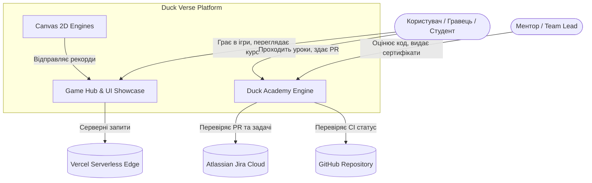

# 🏛️ ADR-002: Системний дизайн платформи Duck Verse та визначення меж доменів (Domain Boundaries)

- **Статус**: Accepted
- **Власник (Owner)**: Yarik0505 (Team Lead, greenyarik0505@gmail.com)
- **Дата створення**: 2026-09-16
- **Версія**: v1.0
- **Дата перегляду (Review Date)**: 2026-12-16
- **Пов'язана задача Jira**: SCRUM-66
- **Цільовий Pull Request**: feature/SCRUM-66-system-design-adr-review
- **Версія релізу**: v1.5.0

---

## 1. Контекст та постановка проблеми (Context & Problem Statement)

Зі швидким розширенням Duck Verse від простого ігрового хабу до комплексної екосистеми (Game Hub + Neon Geometry Dash + Duck Academy з рівнями L0-L9, RBAC, менторським рев'ю, гейтами якості та лідербордами) виник ризик перетворення кодової бази на моноліт із заплутаними залежностями (spaghetti architecture).

Необхідно чітко зафіксувати:
1. **Межі 6 ключових доменів**: Hub, Games, Academy, Auth, Data, Integrations.
2. **Контракти взаємодії** між клієнтом (React/Next.js) та автономними Canvas-рушіями.
3. **Правила залежностей** (Academy та Hub не повинні прямо мутувати стан Canvas-ігор; Auth керує виключно авторизацією та ролями; Data ізолює сховище очок).

---

## 2. Критерії оцінки рішення (Decision Drivers)

1. **Продуктивність (Performance)**: Ігрові рушії повинні працювати на стабільних 60 FPS без блокування Virtual DOM React.
2. **Безпека (Security)**: Запобігання ескалації привілеїв, верифікація сесій через HMAC-SHA256, ізоляція чутливих дій ментора/адміна.
3. **Масштабованість та розширюваність (Extensibility)**: Легкість додавання нових навчальних модулів чи ігор без регресій у існуючих доменах.
4. **Простота експлуатації (Operability & Zero Overhead)**: Розгортання через безсерверні edge-функції Vercel без потреби в окремих бекенд-кластерах.

---

## 3. Доменні межі платформи (Domain Boundaries)

| Домен | Відповідальність | Ключові модулі / файли | Дозволені взаємодії |
| :--- | :--- | :--- | :--- |
| **Hub (UI Hub)** | Вітрина ігор, каталог, фільтри, модальні вікна запуску, магазин скінів, глобальна навігація | `app/page.js`, `components/*`, `lib/skins.js` | Читає стан Auth, передає конфіг у Games, перенаправляє в Academy |
| **Games (Canvas 2D)** | Автономні ігрові цикли (60 FPS), фізика, хітбокси, Web Audio 130 BPM синтезатор | `public/games/*`, `public/audio.js` | Ізольоване полотно `#game-canvas`; викликає callback завершення та відправляє score |
| **Academy (EdTech)** | Реєстр курсів (L0-L9), треки, прогрес, менторська рубрика, гейти Capstone, видача сертифікатів | `app/academy/*`, `lib/academy/*`, `app/api/academy/*` | Використовує Auth для RBAC, Data для прогресу, Integrations для Jira/PR |
| **Auth & Security** | Сесії, кукі, токени, RBAC ролі (student, mentor, admin), захист від фальсифікації | `lib/academy/auth/*`, `app/api/academy/auth/*` | Надає інформацію про поточного користувача всім доменам |
| **Data & Persistence** | Збереження рекордів (Leaderboard), локальні кеші, резервне копіювання прогресу | `app/api/scores/*`, `lib/academy/capstone/workflow.js` | Зберігає рекорди та прогрес; валідує формати вхідних даних |
| **Integrations** | Інтеграція з Jira Cloud REST API, GitHub Pull Requests, Vercel CI/CD | `lib/academy/integrations/*`, `jira_helper.py` | Лише серверні виклики (read-only валідація, webhook/API перевірки) |

---

## 4. Контекстна та контейнерна діаграма (C4 Model / Mermaid)

### C4 Level 1: System Context Diagram


### C4 Level 2: Container Diagram & Data Flows
```mermaid
graph LR
    subgraph ClientBrowser [Клієнтський Браузер]
        ReactUI[React 19 App Router UI]
        GameCanvas[Canvas 2D Engine 60FPS]
        LocalStorage[(LocalStorage Cache)]
    end

    subgraph VercelEdgeLayer [Vercel Edge / Serverless API]
        AuthAPI[/api/academy/auth/*]
        ScoreAPI[/api/scores]
        CapstoneAPI[/api/academy/capstone/*]
        MentorAPI[/api/academy/mentor/*]
        SysDesignAPI[/api/academy/sysdesign/*]
    end

    ReactUI -->|Малює інтерфейс| GameCanvas
    GameCanvas -->|Очки гри| ReactUI
    ReactUI -->|HTTP Fetch + Bearer/Cookie| AuthAPI
    ReactUI -->|Збереження рекорду| ScoreAPI
    ReactUI -->|Статус дипломного проекту| CapstoneAPI
    ReactUI -->|Оцінювання робіт| MentorAPI
    ReactUI -->|Валідація архітектури| SysDesignAPI
    ReactUI <-->|Синхронізація монет/скінів| LocalStorage
```

---

## 5. Розглянуті варіанти архітектури (Options Considered)

### Варіант А: Монолітний Single-Bundle React SPA (Без чітких меж)
- **Опис**: Усі ігри, хаб та академія компілюються в один єдиний React-бандл, ігровий цикл живе всередині `useEffect`.
- **Переваги (+)**: Простий старт, спільний стан у React Context.
- **Недоліки (-)**: Фатальні просідання FPS через постійний React re-render під час колізій; високий ризик `innerHTML` wipeout багів; гігантський розмір бандлу (> 1.5MB).

### Варіант Б: Мікросервісна архітектура (Окремі Node.js / Go бекенди для кожного домену)
- **Опис**: Винесення Auth, Scores, Academy та Jira у незалежні Docker-контейнери з Kubernetes/ECS.
- **Переваги (+)**: Повна ізоляція процесів та баз даних.
- **Недоліки (-)**: Величезні витрати на інфраструктуру; оверхед на мережеві затримки; надмірна складність для навчально-ігрової платформи на даному етапі.

### Варіант В (ОБРАНО): Модульний Next.js 15 App Router + Автономні Canvas рушії з чіткими межами
- **Опис**: React відповідає за швидкий та доступний UI, автономні Canvas-скрипти рендерять ігри без навантаження на React Virtual DOM, а Serverless Route Handlers забезпечують безпечний бекенд для кожного домену.
- **Переваги (+)**:
  - Максимальна продуктивність (чисті 60 FPS для Canvas 2D).
  - Миттєвий Cold Start та автоскейлінг завдяки Vercel Serverless Edge.
  - Нульові додаткові витрати на серверний хостинг.
  - Чітка типізація та модульна ізоляція у директорії `lib/academy/*`.
- **Недоліки (-)**: Необхідність суворо дотримуватися контрактів між Canvas та React через DOM-події та колбеки.

---

## 6. Прийняте рішення та обґрунтування (Decision Outcome & Rationale)

**Одноголосно обрано Варіант В**.
Це рішення забезпечує ідеальний баланс між швидкістю розробки, продуктивністю ігрового рушія, безпекою сесій та нульовою вартістю хмарної інфраструктури.

---

## 7. Відхилені варіанти (Rejected Options)

1. **Варіант А (Single-Bundle React SPA з Canvas у useEffect)**:
   - *Причина відхилення*: При частоті 60 FPS перемальовування компонентів React викликало фатальні блокування головного потоку, порушуючи SLA та плавний геймплей.
2. **Варіант Б (Розподілені мікросервіси в Docker)**:
   - *Причина відхилення*: Невиправданий фінансовий та експлуатаційний оверхед (devops-борг) на етапі запуску платформи.

---

## 8. Наслідки (Consequences)

### Позитивні наслідки (+)
- Зниження часу завантаження сторінок (LCP < 1.2s).
- Захищений контур авторизації з контролем ролей (RBAC).
- Додавання нових ігор та навчальних уроків не потребує переписування ядра.

### Компроміси (-)
- Необхідність проводити Architecture Review Checkpoint для будь-якої нової фічі senior-рівня.

---

## 9. План відкату та міграції (Rollback Plan)

- Усі конфігурації зберігаються як чистий код (code as configuration).
- У разі збою в новому домені активується Feature Flag вимкнення або відбувається моментальний Vercel Instant Rollback до стабільного deployment hash за 1 клік.

---

## 10. Стратегія валідації (Validation Strategy)

- 100% покриття тестами юніт-модулів у `tests/academy_*.test.mjs`.
- Повна перевірка лінтингу та білду `npm run build`.
- Автоматизована live-перевірка через Headless Chrome у продакшені (0 unhandled exceptions).
