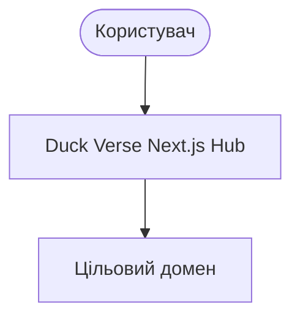

# 🏛️ ADR-TEMPLATE: Шаблон архітектурного рішення (Duck Verse Architecture Decision Record)

- **Статус**: Proposed | Accepted | Rejected | Superseded
- **Власник (Owner)**: [Ім'я / Jira Account ID]
- **Дата створення**: [YYYY-MM-DD]
- **Версія**: [v1.0]
- **Дата перегляду (Review Date)**: [YYYY-MM-DD]
- **Пов'язана задача Jira**: [SCRUM-XX]
- **Цільовий Pull Request**: [PR #XX]
- **Версія релізу**: [vX.Y.Z]

---

## 1. Контекст та постановка проблеми (Context & Problem Statement)

[Опишіть контекст, бізнес-потребу або технічну проблему, що вимагає системного рішення. Які фактори змушують нас приймати рішення зараз?]

---

## 2. Критерії оцінки рішення (Decision Drivers)

Рішення має задовольняти такі ключові фактори:
1. **Безпека (Security)**: [RBAC, захист даних, валідація вводу]
2. **Продуктивність (Performance)**: [SLA, FPS для ігор, час відповіді API < 100ms]
3. **Вартість та оверхед (Cost & Complexity)**: [Витрати на хостинг, простота підтримки]
4. **Експлуатаційна надійність (Operability)**: [Спостережуваність, логування, простота деплою]

---

## 3. Доменні межі та контекстна діаграма (Domain Boundaries & C4 Diagram)

[Вкажіть, яких доменів стосується рішення: Hub | Games | Academy | Auth | Data | Integrations]

---

## 4. Розглянуті варіанти (Options Considered)

### Варіант А: [Назва варіанту 1]
- **Опис**: [Короткий зміст]
- **Переваги (+)**:
  - [Плюс 1]
- **Недоліки (-)**:
  - [Мінус 1]

### Варіант Б: [Назва варіанту 2]
- **Опис**: [Короткий зміст]
- **Переваги (+)**:
  - [Плюс 1]
- **Недоліки (-)**:
  - [Мінус 1]

---

## 5. Прийняте рішення та обґрунтування (Decision Outcome & Rationale)

**Обрано**: [Варіант X].

**Чому саме цей варіант?**
[Детальне обґрунтування вибору з урахуванням критеріїв Decision Drivers].

---

## 6. Відхилені варіанти та причина відхилення (Rejected Options)

- **[Відхилений варіант Y]**: [Чому саме цей варіант було відхилено (наприклад, завеликий оверхед, ризики безпеки або порушення SLA)].

---

## 7. Наслідки рішення (Consequences)

### Позитивні наслідки (+)
- [Покращення 1]

### Негативні наслідки та компроміси (-)
- [Компроміс 1]

---

## 8. План відкату та міграції (Rollback & Mitigation Plan)

- **Стратегія відкату**: [Як безпечно повернути стан до змін у разі критичного інциденту]
- **План міграції даних**: [Чи потрібна міграція schemas / storage?]

---

## 9. Стратегія валідації та тестування (Validation & Test Plan)

- [ ] Unit-тести на рівні доменної логіки
- [ ] Contract/API тести роутів
- [ ] Локальний `npm run build`
- [ ] Live Headless перевірка у продакшені (0 exceptions)
